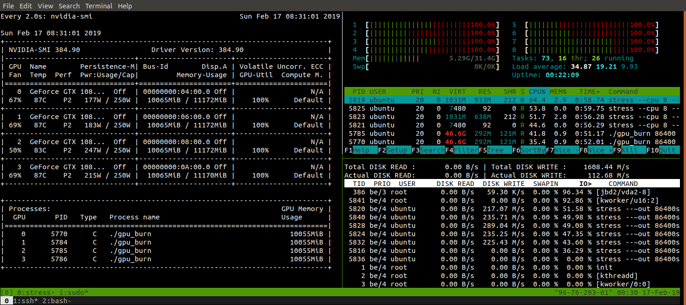

# Perform GPU, CPU, and I/O stress testing on Linux

<p align="center">
    
    Figure 1. CPU, GPU, and I/O utilization monitoring using tmux, htop, iotop, and nvidia-smi. This stress test is running on a Lambda GPU Cloud 4x GPU instance.
</p>

Often times you'll want to put a system through the paces after it's been set up. To stress test a system for simultaneous GPU and CPU loads, we'll use two stress tools: `stress` and `gpu_burn`, and three monitoring tools: `htop`, `iotop` and `nvidia-smi`. The easiest way to make your own monitoring tool with the output of a script is with the `watch` command. This article assumes you have the proper GPU drivers in place, check out [Lambda Stack](https://lambdalabs.com/lambda-stack-deep-learning-software) if you need to install CUDA, CuDNN, and the NVIDIA drivers.

## Install stress, htop, and iotop

On Ubuntu, you can install `stress`, `htop`, and `iotop` via `apt`.

```bash
sudo apt install -y stress htop iotop lm-sensors
# Run a stress test with `nproc` CPU workers (sqrt)
#                        `nproc` Virtual Memory workers (malloc / free)
#                        `nproc` workers calling (sync)
#                        `nproc` workers writing to disk (write / unlink)
# For a total of 60 seconds.
stress --cpu `nproc` --vm `nproc` --vm-bytes 1GB --io `nproc` --hdd `nproc` --hdd-bytes 1GB --timeout 60s
```

## Install and run gpu-burn

```bash
git clone https://github.com/wilicc/gpu-burn && cd gpu-burn
make -j $(nproc)
./gpu_burn 60 # will run gpu_burn for 60 seconds
```

## Monitor with htop, nvidia-smi, and sensors

I like to use `tmux` to split my terminal and have `htop`, `sudo iotop`, `watch sudo sensors`, and `watch nvidia-smi` running simultaneously. You can use this to monitor the CPU, memory, I/O bandwidth, and GPU utilization of your system as well as the CPU and GPU temperatures.

This is a great way to ensure your system is working up to spec.

## References

[Perform GPU, CPU, and I/O stress testing on Linux](https://lambdalabs.com/blog/perform-gpu-and-cpu-stress-testing-on-linux/)
