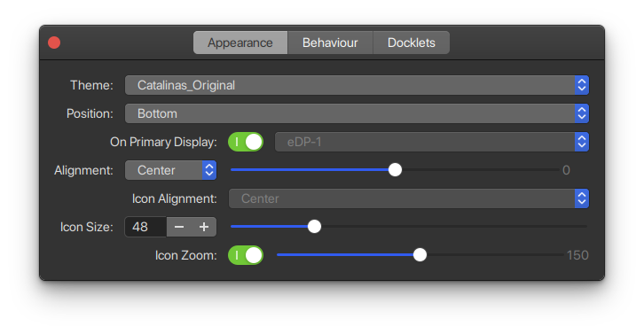

# Making Ubuntu Look Like macOS <!-- omit in toc -->

## Contents <!-- omit in toc -->

- [Prerequisites](#prerequisites)
- [Installing macOS inspired GTK Theme](#installing-macos-inspired-gtk-theme)
- [Installing macOS like Icons](#installing-macos-like-icons)
- [Changing System Font](#changing-system-font)
- [Installing macOS like Dock](#installing-macos-like-dock)
  - [Plank Dock](#plank-dock)
  - [Dash to Dock](#dash-to-dock)
- [References](#references)

Highly customization is one of the main reasons why Ubuntu is preferred. There is a wide range of tweaks you can choose to personalize Ubuntu desktop. You can change icons, themes, change fonts, change terminals, add screenlets, indicator applets and extensions.

This document will show you how to make Ubuntu look like macOS.

> Although this article suggests it’s for Ubuntu, you can follow it for other distributions with GNOME desktop with little or no changes. [2]

## Prerequisites

- [Ubuntu 20.04 LTS](https://ubuntu.com/)
- GNOME Tweaks Tool and GNOME Extensions

```bash
sudo apt-get install -y \
    gnome-tweak-tool \
    gnome-shell-extensions
```

## Installing macOS inspired GTK Theme

Since the focus is on making GNOME look like macOS, you should choose a macOS like theme. There are plenty of themes which are macOS like.

- [Catalina](https://www.pling.com/p/1226871)
- [McMojave](https://www.pling.com/p/1275087)

> `McMojave-dark` (2020-06-11) is recommended.

```bash
mkdir ~/.themes
mv <extracted>/<theme>/<folder> ~/.themes
```

## Installing macOS like Icons

Here are suggested icon sets that you can download from Gnome-look website:

- [Cupertino iCons Collection](https://www.gnome-look.org/s/Gnome/p/1102582)
- [McMojave-circle](https://www.gnome-look.org/p/1305429/)
- [Mojave CT icons](https://www.gnome-look.org/p/1210856/)

> `Cupertino iCons Collection Original` (2020-07-16) and `McMojave-circle` (2020-07-02) are recommended.

```bash
# If using McMojave-circle
sudo apt install numix-icon-theme-circle

mkdir ~/.icons
mv <extracted>/<theme>/<folder> ~/.icons
```

## Changing System Font

A quick Google should turn up plenty more information (and links to download San Francisco font) but be aware that neither font is not licensed for distribution.

What you can do is to use an open source font that looks similar to the San Francisco fonts. I recommend using [Roboto](https://fonts.google.com/specimen/Roboto?query=robot) font by Google or [Source Sans Pro](https://adobe-fonts.github.io/source-sans-pro/) by Adobe.

After downloading, extracting all fonts to `~/.fonts` directory. Once you have installed the fonts, you can change the system wide font using `GNOME Tweaks tool.`

## Installing macOS like Dock

<p align="center">
  
  <p style="text-align:center">Figure 1. macOS Dock</p>
</p>

<p align="center">
  
  <p style="text-align:center">Figure 2. macOS like Dock using plank</p>
</p>


One important thing to make Ubuntu look like macOS most is the Dock.
There are two ways to accomplish this one:

- `Plank Dock`, which replicates macOS experience most such as `magnification`.
- `Dash to Dock`, which is a GNOME extension.

> `magnification`: magnify icons when you move the pointer over them.

### Plank Dock

#### Installing packages <!-- omit in toc -->

```bash
sudo apt-get install -y \
    dconf-editor plank
```

#### Hiding Ubuntu Dock <!-- omit in toc -->

```bash
# Dock not shown on mouse over
gsettings set org.gnome.shell.extensions.dash-to-dock autohide false

# Dock always invisible
gsettings set org.gnome.shell.extensions.dash-to-dock dock-fixed false

# Dock doesn't dodge windows
gsettings set org.gnome.shell.extensions.dash-to-dock intellihide false
```

#### Configuring Plank Dock <!-- omit in toc -->



You can download a `plank theme`, extract it to `~/.local/share/plank/themes` directory and enable it with `Theme.`
Moreover, `Icon Zoom` enables macOS like `magnification`.

> [Catalinas-Original](https://www.gnome-look.org/p/1311056/) (2020-06-18) is recommended.

### Dash to Dock

```bash
# Dock always invisible
gsettings set org.gnome.shell.extensions.dash-to-dock dock-fixed false

# Dock position
gsettings set org.gnome.shell.extensions.dash-to-dock dock-position BOTTOM

# Don't extend the dock container to all the available height
gsettings set org.gnome.shell.extensions.dash-to-dock extend-height false
```

## References

[1] Logix. (). “How to remove or disable ubuntu dock,” [Online]. Available: https://www.linuxuprising.com/2018/08/how-to-remove-or-disable-ubuntu-dock.html. (accessed: 06.22.2020)

[2] Community. (). “How to Make Ubuntu Look Like macOS in 5 Easy Steps,” [Online]. Available: https://itsfoss.com/make-ubuntu-look-like-macos/. (accessed: 06.22.2020)