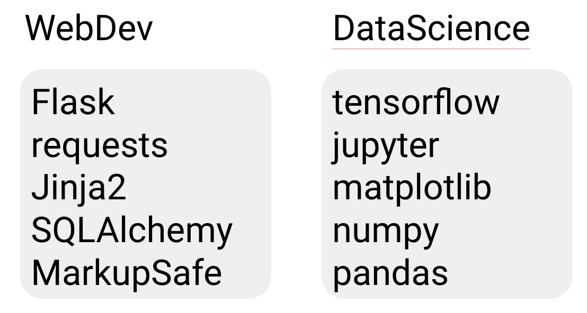

# Configuring Python Development Environment <!-- omit in toc -->

## Contents <!-- omit in toc -->

- [Build Python from source](#build-python-from-source)
- [Manage Python environment for machine learning and data science](#manage-python-environment-for-machine-learning-and-data-science)
  - [Why do we need Virtual Environments?](#why-do-we-need-virtual-environments)
  - [Venv](#venv)
  - [Virtualenv](#virtualenv)
  - [Anaconda](#anaconda)
- [References](#references)

Sometimes your Linux distribution will not have the latest version of Python, or maybe you just want to be able to build the latest version yourself. Here are the steps you need to do so.

> While the instructions might work for other systems, it is only tested and supported for Ubuntu.

## Build Python from source

```bash
VERSION='3.7.7'
DOWNLOAD_URL="https://www.python.org/ftp/python/$VERSION/Python-${VERSION}.tgz"

# Install dependencies
sudo apt-get update && sudo apt-get install -y \
    software-properties-common build-essential curl wget \
    libexpat1-dev libssl-dev zlib1g-dev \
    libncurses5-dev libbz2-dev liblzma-dev \
    dpkg-dev libreadline-dev libsqlite3-dev \
    libffi-dev tcl-dev libgdbm-dev bluez libbluetooth-dev libglib2.0-dev \
    python3 python3-dev libboost-python-dev libboost-thread-dev \
    python3-tk tk-dev

wget -O python.tar.tgz "${DOWNLOAD_URL}"
tar -zxf python.tar.tgz && cd Python-$VERSION
./configure \
    --enable-shared \
    --enable-optimizations \
    --enable-loadable-sqlite-extensions \
    --enable-ipv6 \
    --with-assertions \
    --with-lto \
    --with-threads
make -j $(nproc)

# By default, exec_prefix=/usr/local
# which is the location of the built interpreter.
#
# Warning: `make install` can overwrite or masquerade the `python3` binary.
# `make altinstall` is therefore recommended instead of `make install`
# since it only installs `exec_prefix/bin/pythonversion`.
#
# See details at
# https://docs.python.org/3/using/unix.html#building-python
sudo make altinstall

sudo update-alternatives --install /usr/local/python python /usr/local/bin/python3.7 30
sudo update-alternatives --install /usr/local/python3 python3 /usr/local/bin/python3.7 30
```

By default , `pip` is being automatically installed along as Python. But maybe it isn't there for some reason. In this case, you can manually install `pip` using `get-pip`.

```bash
# python3 -m pip install -U pip
curl https://bootstrap.pypa.io/get-pip.py -o get-pip.py
python3 get-pip.py
```

## Manage Python environment for machine learning and data science

### Why do we need Virtual Environments?

Python, like most other modern programming languages, has its own unique way of downloading, storing, and resolving packages (or [modules](https://en.wikipedia.org/wiki/Modular_programming)). While this has its advantages, there were some interesting decisions made about package storage and resolution, which has lead to some problems—particularly with how and where packages are stored. [3]

As part of this ecosystem, there is a whole world of version numbers and dependencies. You sometimes need to use different versions of a given library for different projects that you are working on, so you need a way to organize your groups of packages into different, isolated environments. [2]

> Note: A virtual environment is a Python environment such that the Python interpreter, libraries and scripts installed into it are isolated from those installed in other virtual environments, and (by default) any libraries installed in a “system” Python, i.e., one which is installed as part of your operating system. [1]

<p align='center'>
    
<p>

There are currently two popular options for taking care of managing your different packages: _venv_, _virtualenv_ and _anaconda_.

### Venv

If you are using Python 3, then you should already have the [venv](https://docs.python.org/3/library/venv.html) module from the standard library installed.

[venv](https://docs.python.org/3/library/venv.html#module-venv) will usually install the most recent version of Python that you have available. If you have multiple versions of Python on your system, you can select a specific Python version by running python3 or whichever version you want.

#### Usage <!-- omit in toc -->

Create a virtual environment, decide upon a directory where you want to place it, and run the venv module as a script with the directory path:

```bash
python3 -m venv tutorial-env
```

Activate the virtual environment using a shell-specific command:

```bash
source tutorial-env/bin/activate
```

When the environment is active, your shell prompt is prefixed with `(tutorial-env)`.

Install packages within the environment without affecting the host system setup. Start by upgrading pip:

```bash
(tutorial-env) python -m pip install --upgrade pip
(tutorial-env) pip list  # show packages installed within the virtual environment
```

And to exit the environment later:

```bash
(tutorial-env) deactivate
```

**Note:** When you publish a repository, you should provide `requirements.txt` at the root folder to help other who want to run your code create the virtual environment as same as yours.

```bash
(tutorial-env) pip freeze > requirements.txt

# Recreate the environment in another computer, etc.
python3 -m venv tutorial-env
source tutorial-env/bin/activate
(tutorial-env) pip install -r requirements.txt
```

### Virtualenv

Virtualenv is a package that allows you to create named `virtual environments`, where you can install pip packages in an isolated manner.

[This tool is great](https://pypi.python.org/pypi/virtualenv) if you want to have detailed control over which packages you install for each environment you create. For example, you could create an environment for web development with one set of libraries, and a different environment for data science.

#### Usage <!-- omit in toc -->

Create a new virtual environment by choosing a Python interpreter and making a `./venv` directory to hold it:

```bash
# `--system-site-packages` will inherit global packages.
# This can be used if you have control over the global site-packages directory.
# Otherwise, if you want isolation from the global system, do not use this flag.
virtualenv --system-site-packages -p python3 ./venv
```

Activate the virtual environment using a shell-specific command:

```bash
source ./venv/bin/activate
```

When the environment is active, your shell prompt is prefixed with `(venv)`.

Install packages within the environment without affecting the host system setup. Start by upgrading pip:

```bash
(venv) python -m pip install --upgrade pip
(venv) pip list  # show packages installed within the virtual environment
```

And to exit the environment later:

```bash
(venv) deactivate
```

### Anaconda

Now, if you are primarily doing data science work, _Anaconda_ is also a great option. [Anaconda](https://www.anaconda.com/download) is created by Continuum Analytics, and it is the world’s most popular Python distribution platform that comes pre-installed with lots of data science and machine learning packages.

Similar to virtualenv, Anaconda also uses the concept of creating environments so as to isolate different libraries and versions. Anaconda also introduces its own package manager, called `conda`, from where you can install libraries. [2]

Additionally, Anaconda still has the useful interaction with pip that allows you to install any additional libraries which are not available in the Anaconda package manager. [2]

#### Usage <!-- omit in toc -->

Create a new conda environment from a list of specified packages.

```bash
# conda create [--name ENV_NAME] [package_spec]
conda create --name venv python=3.7 numpy=1.17
```

Activate the virtual environment using a shell-specific command:

```bash
conda activate venv
```

Install packages within the environment without affecting the host system setup:

```bash
(venv) conda install pandas jupyterlab
(venv) conda list # show packages installed within the virtual environment
```

And to exit the environment later:

```bash
(venv) conda deactivate
```

## References

[1] P. S. Foundation. (). Venv — creation of virtual environments, [Online] Available: https://docs.python.org/3/library/venv.html
. (accessed:
05.17.2020).

[2] Y. Guo. (). Which python package manager should you use? [Online]. Available: https://towardsdatascience.com/which-python-package-manager-should-you-use-d0fd0789a250. (accessed: 05.17.2020).

[3] R. Python. (). Python virtual environments: A primer, [Online]. Available: https://realpython.com/python-virtual-environments-a-primer/. (accessed: 05.17.2020).

[4] P. S. Foundation, (). Virtual environments and packages, [Online]. Available: https://docs.python.org/3/tutorial/venv.html. (accessed: 05.17.2020).
